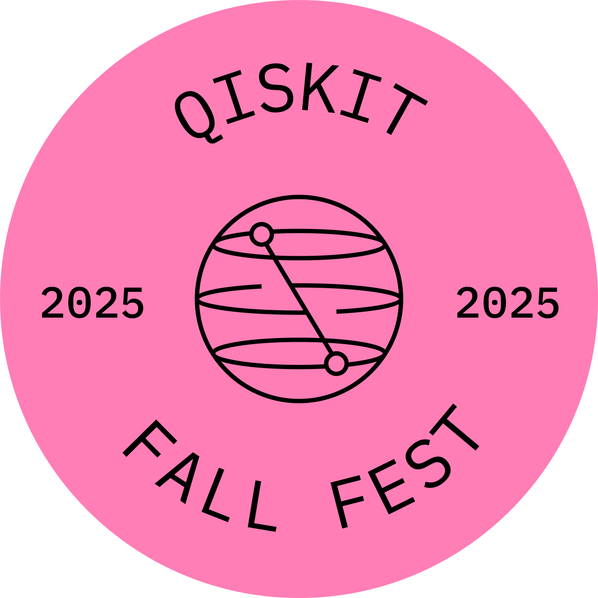

# Qiskit-Fall-Fest-Monash 2025 

Welcome to the Qiskit Fall(Spring) Fest at Monash Uni! 

This repository is for materials and registration for the event. 

## What is Fall Fest?
Qiskit Fall Fest is a global series of quantum computing events run each year by students and volunteers around the world, in collaboration with IBM Quantum.

At Monash, our Fall Fest is all about making quantum accessible:

✨ Learn the basics of qubits, gates, and circuits

💻 Get hands-on with IBM’s real quantum computers through Qiskit

🎤 Hear from guest speakers in quantum research and industry

🚀 Explore the future of quantum technology

This event is aimed at students in science, computer science, IT, engineering, mathematics, and related fields — but everyone is welcome to come and explore quantum!

## How can I participate?
You can attend this event both in-person and virtually!

Limited spots available for in-person event.

[Pre-register here](https://forms.gle/Vpe2GybGMAv2w8CNA) 

  

## Event Info
👉 What to bring:

- A laptop (for coding sessions)
- Enthusiasm and curiosity!
- Some coding experience (Python is useful)

No prior quantum knowledge is expected — we’ll guide you from the basics all the way to running your first circuits on a real quantum computer.

📅 Date: 29th October 2025

🕙 Time: 10:00 AM – 3:30 PM

📍 Location: Monash Clayton Campus, Room to be confirmed closer to the event

## Event Agenda / Schedule

**10:00–10:20**  
- **Welcome / Opening remarks**

**10:20–11:20**  
- **Quantum & Qiskit 101**:
  *Intro to qubits, gates, measurement, entanglement, and how Qiskit is used in practice*  

**11:20–12:15**  
- **Qiskit Fundamentals Lab**: *Learn the basics of coding for a quantum computer*  
- **Hands-on Notebook Session**: Run your first circuits on a **real quantum computer** via the IBM Quantum platform  

**12:15–1:00**  
- Lunch Break  

**1:00–1:30**  
- Guest Speaker: TBC  
- Talk: TBC  

**1:30–2:30**  
- **Hands-on Notebook Session**: Continue practice or explore challenge notebooks  
- For participants who want to go further: optional challenges such as **quantum cryptography (BB84 QKD)** or **protein structure prediction**  

**2:30–3:00**  
- **Showcase**: *Quantum at Monash*  
  *Short presentations and demos of current research highlights*  

**3:00–3:30**  
- **Kahoot Quiz**: *Test your understanding and win a prize!*  
- **Closing remarks**  

## Other Information
*Stay tuned — we’ll add the following here closer to the event:*
- links notebook exercises
- speaker profiles
- solutions to exercises

